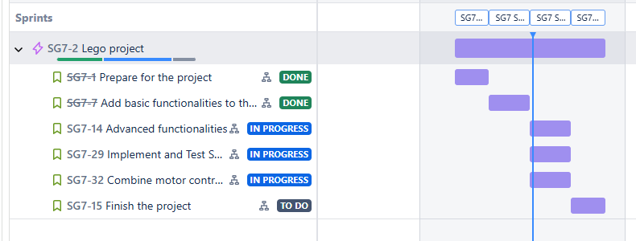

# Applied Application Project - Group 7
## Project info
In this project we aim to make a **EV3 Lego Mindstorm robot** move alongside a track using **Light Sensor** and avoid obstacles using **Ultra Sonic Sensor**.

## Main objectives
- to learn how to use **java threads**
- to learn how to use **LeJOS library** for the robot
- to deepen our under understanding of **OOP**
- to create a smart robot that will avoid obstacles using an **Ultra Sonic Sensor**
- to make the robot move alongside a certain path while using a **Light Sensor**

## Tools
For this project we are using **Visual Studio Code** as an IDE for programming, **Java** as the programming language, **LeJOS library** to control the **EV3 robot**, **GitHub** as a **Version Control system**, **Jira** and **Confluence** to make a clear schedule and document our progress during this project.

## Team

|----------|----------|----------|
| Smorgulenko **Artjom**   | Nguyen **Anh**   | Pasierb **Samuel**   |

## Timelines

 